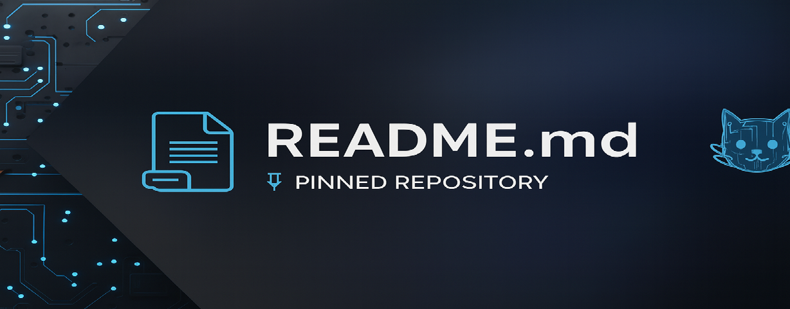

# RoboShaman: Vibe Coder & Therapist Dev

From CA psychotherapy couch to code console—I'm an AMFT (~280 hours from full licensure) pivoting to dev, building AI/SaaS tools that bridge mental health with tech. Soft-launched AI coaching at [roboshamanai.com](https://roboshamanai.com) (betas welcome—0 clients, but vibes are infinite).

**Specialties:** Systems thinking, AI agent whispering (I've leveled up colleagues' workflows), ACT/trauma-informed tools, and ethical AI for clinicians + entrepreneurs.

---

## 🔧 What's Building (Updated Dec 2025)

- **BrightEyedTherapist**: Open-source AI prompts for ACT/CBT session notes, burnout trackers, and therapy recaps. Built with Claude/Gemini integrations.  
  [Repo](https://github.com/shamanakin/BrightEyedTherapist) | Fork & contribute!

- **Outfox-Frontend-Test** *(Evolving)*: Frontend experiments turning into a clinician dashboard UI (React/HTML). Testing vibe-aligned UX for therapy apps.  
  [Repo](https://github.com/shamanakin/Outfox-Frontend-Test)

- **Upcoming Ships**: RoboShaman AI Coaching app—personalized, agentic guidance for pros. Next: No-code prompt library for Cursor users. Watch for #BuildInPublic threads on X.

---

## 🛠 My Stack & Interests

| Area | Details |
|------|---------|
| **Languages** | JS/Node.js (frontend vibes), Python (AI agents) |
| **Tools** | Cursor for agentic coding, Claude 3.5/Gemini for prompt engineering, Cal.com for consult bookings |
| **Focus Areas** | Ethical AI in mental health (#TherapyTech), workflow automations for therapists/entrepreneurs, indie SaaS |
| **Background** | BS Psychology, MS Counseling; 5+ years private practice; ex-network admin (systems roots run deep) |

---

## 🤝 Collab & Connect

**Get Involved:** Star/fork repos, DM on X for AI workflow consults (free 20-min intros), or join the waitlist at roboshamanai.com.

  
  
  

---

  
   
  
   
  

---

  <em>Healing through code. Let's vibe & build. 🚀</em>

